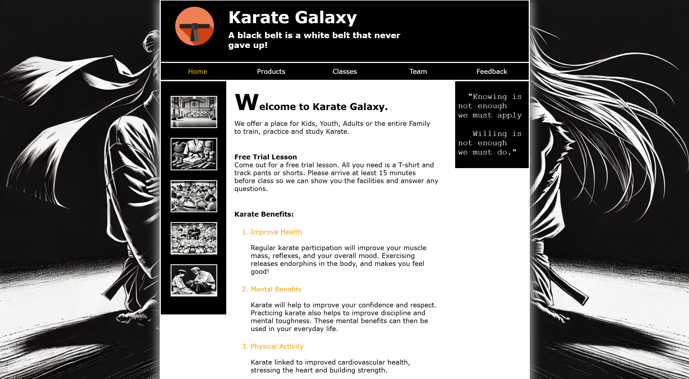

# Karate Galaxy

## 🌟 Overview

Karate Galaxy is a simple yet meaningful website built using HTML and CSS as part of my college assignment. While it started as a basic project, it holds sentimental value as it marks the beginning of my web development journey. This website serves as a foundation for learning web design principles and structuring content effectively.

## 🚀 Features

- 🏠 Home Page: Provides a brief introduction to karate and its values.
- 🛍️ Products Page (Under Construction): Intended to allow visitors to browse and purchase karate-related items.
- 🥋 Classes Page: Displays the class schedule for different training programs.
- 👨‍🏫 Team Page: Showcases the talented team of senseis teaching at the dojo.
- 📝 Feedback Page: Includes a form where users can submit feedback about the website or their training experience.

## 🔧 Technologies Used
- 🖥️ HTML5 – Structure and content of the website.
- 🎨 CSS3 – Styling and layout design.
- 🤖 AI-Generated Images – Used to create visually engaging elements.

## 📂 How to View the Website
1. Clone or download the repository.
2. Open index.html in any web browser.

## ✨ Why I Keep This Project
Karate Galaxy is a reminder of how my journey in web development began. From learning basic HTML and CSS to eventually building more advanced projects, this website represents my early understanding of structuring and styling web pages.

## 🔮 Future Improvements

- ✨ Add JavaScript for interactive elements.
- 📱 Make the website responsive.
- 🎨 Enhance the UI/UX design.
- 🛍️ Complete the products page with e-commerce functionality.
- 🐍 Set up a Python server to handle backend functionality and data processing.

## 📜 License

This project is licensed under the MIT License. Feel free to use, modify, and distribute it as per the license terms. 🥋🌌
